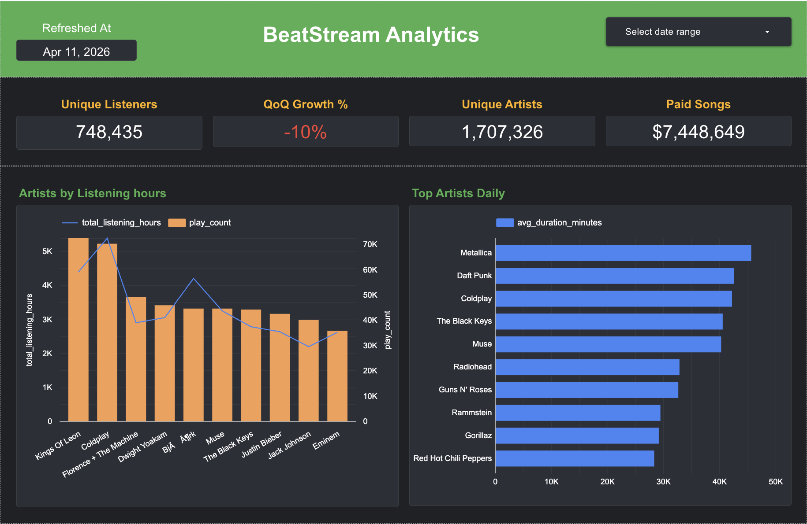
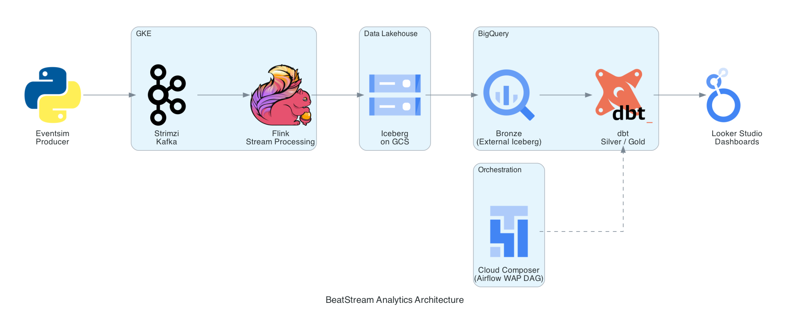
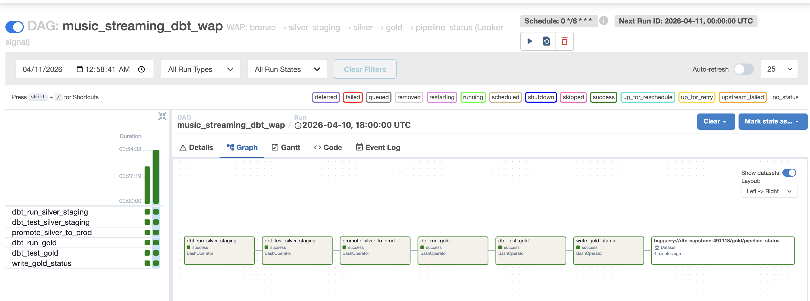

# Music Streaming Analytics Pipeline

A end-to-end data engineering capstone project simulating a real-time music streaming analytics platform. The pipeline ingests synthetic user events, streams them through Kafka and Flink, stores them as open Iceberg tables on GCS, and transforms them through a medallion architecture in BigQuery using dbt — all orchestrated by Apache Airflow on Cloud Composer and visualised in Looker Studio.

---

## Goal and Impact

Music streaming platforms generate millions of events per day — song plays, page views, authentication events, and subscription changes. The goal of this pipeline is to turn that raw event stream into trusted, analytics-ready data that answers business questions like:

- How many unique listeners did we have this quarter vs last quarter?
- What are the top artists and songs by day?
- When are peak listening hours?
- Are users upgrading or downgrading their subscriptions?

The pipeline is designed to be **engine-agnostic** (data stored in open Iceberg format, readable by any engine), **fault-tolerant** (WAP pattern prevents bad data reaching dashboards), and **cost-efficient** (external tables avoid BigQuery storage costs while retaining full SQL access).

## Link to Looker Dashboard
[Looker Dashboard BeatSream Analytics](https://lookerstudio.google.com/s/niq5j3dzzz0)

### Snapshot of Dashboard for Preview



---

## Architecture



---

## Setup

### Prerequisites

- GCP account with billing enabled ($300 free credits available with a new account. I have personally utilized free credits for this project)

**Install CLI tools (macOS with Homebrew):**

```bash
# gcloud CLI
brew install --cask google-cloud-sdk
gcloud init
gcloud auth login
gcloud auth application-default login

# Terraform >= 1.5
brew tap hashicorp/tap
brew install hashicorp/tap/terraform

# Docker Desktop
brew install --cask docker
open /Applications/Docker.app   # starts the Docker daemon; wait for the whale icon in the menu bar

# kubectl
brew install kubectl

# helm
brew install helm
```

**Windows (winget — run PowerShell as Administrator):**

```powershell
# gcloud CLI
winget install --id Google.CloudSDK -e
# Open a new terminal after install, then:
gcloud init
gcloud auth login
gcloud auth application-default login

# Terraform
winget install --id Hashicorp.Terraform -e

# Docker Desktop
winget install --id Docker.DockerDesktop -e
# Open Docker Desktop from the Start menu and wait for it to start

# kubectl
winget install --id Kubernetes.kubectl -e

# helm
winget install --id Helm.Helm -e
```

Install Python dependencies using [uv](https://github.com/astral-sh/uv) (faster alternative to pip):

**macOS / Linux:**
```bash
# Install uv
curl -LsSf https://astral.sh/uv/install.sh | sh

# Create virtual environment and install all dependencies from pyproject.toml
uv venv .venv
source .venv/bin/activate
uv pip install .

# Install dev dependencies (pytest, ruff, etc.)
uv pip install --group dev .
```

**Windows (PowerShell):**
```powershell
# Install uv
powershell -ExecutionPolicy ByPass -c "irm https://astral.sh/uv/install.ps1 | iex"

# Create virtual environment and install all dependencies from pyproject.toml
uv venv .venv
.venv\Scripts\activate
uv pip install .

# Install dev dependencies (pytest, ruff, etc.)
uv pip install --group dev .
```

### 1. GCP Account Setup

```bash
# Authenticate
gcloud auth login
gcloud auth application-default login

# Set your project
gcloud config set project YOUR_PROJECT_ID

# Enable required APIs
gcloud services enable \
  container.googleapis.com \
  storage.googleapis.com \
  bigquery.googleapis.com \
  bigqueryconnection.googleapis.com \
  composer.googleapis.com \
  iam.googleapis.com
```

### 2. Terraform Infrastructure

```bash
cd terraform

# Copy and fill in your values
cp terraform.tfvars.example terraform.tfvars
# Edit terraform.tfvars: set project_id, region, bucket names (it is recommended to add your_project_id as prefix to your bucket name to make it glob ally unique)

terraform init
terraform plan -out=tfplan
terraform apply "tfplan"
```

This provisions:
- **GKE cluster** — 2 node pools (general + data), `e2-standard-2`
- **GCS buckets** — Iceberg warehouse, raw events, dbt artifacts
- **IAM** — service accounts, Workload Identity, BigLake connection SA
- **BigQuery connection** — Cloud Resource Connection for BigLake external tables
- **Cloud Composer 3** — managed Airflow environment

> **Quota note**: You need at least 8 CPUs (all regions) for the GKE cluster + Composer. Request a quota increase to a total of 32 CPUs (all regions) at the beginning itself at `console.cloud.google.com/iam-admin/quotas`.

> To Request Quota increase Go to IAM & Admin in hamburger icon on top left and select Quotas & System Limits -> Look for Compute Engine API and under name column CPU (all regions) -> Click the 3 dots on the right and request 32 CPUs

### 3. Deploy Kafka and Flink to GKE

```bash
cd k8s
bash deploy.sh
```

This installs Strimzi (Kafka operator), creates Kafka topics, installs the Flink Kubernetes Operator, and deploys the Flink session cluster.

### 4. Generate Eventsim Data

#### What is Eventsim?

[Eventsim](https://github.com/viirya/eventsim) is a Scala/Java tool that simulates realistic music streaming user behaviour — generating JSON event logs for listen events, page views, authentication, and subscription changes. It models real user sessions, growth rates, and paid/free tier transitions.

#### Why Docker?

Eventsim requires Java 11. On Apple Silicon (ARM64) Macs, JAXB/JNA incompatibilities with newer JVMs cause crashes. Docker with `--platform linux/amd64` resolves this by running the JVM in emulation.

#### Build the Docker image

```bash
# Clone the eventsim repo (one-time setup)
git clone https://github.com/viirya/eventsim.git eventsim-repo

cd eventsim-repo
docker build --platform linux/amd64 -t eventsim .
```

#### Generate data

```bash
cd eventsim

# 2025 Q1
EVENTSIM_START=2025-01-01 EVENTSIM_END=2025-03-31 \
  bash scripts/generate_events_docker.sh

# 2026 Q1
EVENTSIM_START=2026-01-01 EVENTSIM_END=2026-03-31 \
  bash scripts/generate_events_docker.sh
```

Each run generates two files per quarter — `control` (users 1–10,000) and `test` (users 10,001–20,000) — matching an A/B testing design.

Output: `eventsim/output/YYYY_Q1_control.json`, `eventsim/output/YYYY_Q1_test.json`

#### Skip data generation

Pre-generated JSON files are in `eventsim/output/`. You can stream them directly to Kafka without re-running eventsim.

---

## Running the Pipeline

### 5. Stream Events to Kafka

```bash
uv add confluent-kafka

# Get the external Kafka broker IP
kubectl get svc music-streaming-kafka-kafka-external-bootstrap \
  -n kafka -o jsonpath='{.status.loadBalancer.ingress[0].ip}'

python eventsim/scripts/stream_to_kafka.py \
  --output-dir eventsim/output \
  --broker <KAFKA_IP>:9094 \
  --speed-multiplier 0
```

### 6. Submit the Flink Job

```bash
cd k8s/flink/jobs
bash submit-job.sh
```

Flink reads from all 4 Kafka topics and writes to partitioned Iceberg tables on GCS under `gs://YOUR_BUCKET/warehouse/music_streaming/`.

### 7. Create BigQuery Bronze Tables

Once Flink has written data to GCS:

```bash
bash dbt/setup/create_bronze_tables.sh
```

This creates BigLake external tables in the `bronze` dataset pointing to the latest Iceberg metadata snapshots.

### 8. Run dbt

```bash
cd dbt
cp profiles.yml ~/.dbt/profiles.yml   # first time only

dbt run
dbt test
```

---

## Technology Decisions

### Kafka — Event Message Queue

Kafka decouples event producers (eventsim / application servers) from consumers (Flink). This means:
- Producers don't wait for downstream processing to complete
- Events are durable and replayable — if Flink restarts, it resumes from where it left off
- Multiple consumers can independently read the same topic (e.g. Flink for Iceberg + a separate real-time alerting consumer)

Kafka topics are partitioned (4 partitions for listen/page_view, 2 for auth/status_change) to enable parallel consumption.

### Flink — Stateful Stream Processing

Flink was chosen over a batch loader (e.g. loading files directly to BigQuery) because:
- **Exactly-once delivery** via checkpointing — no duplicate events even on failure/restart
- **Streaming inserts to Iceberg** — data lands in GCS continuously rather than in hourly/daily batches
- **Schema enforcement** — Flink SQL validates field types before writing to Iceberg
- **Watermarking** — handles late-arriving events gracefully

Flink uses RocksDB state backend with incremental checkpoints stored in GCS.

### Iceberg on GCS — Open Table Format

Iceberg was chosen as the storage format instead of raw Parquet or a proprietary format because:
- **ACID transactions** — concurrent writes don't corrupt data
- **Schema evolution** — add/rename columns without rewriting existing data
- **Engine agnostic** — the same Iceberg tables can be read by Flink, BigQuery, Spark, Trino, or DuckDB without conversion
- **Time travel** — query any historical snapshot via Iceberg metadata
- **Partition pruning** — data is partitioned by `event_date`, so queries filter efficiently

**Trade-off**: BigQuery reads Iceberg via BigLake external tables, which means query performance is slightly slower than native BigQuery managed tables (no columnar caching, metadata round-trips to GCS).

**How it's compensated**: The silver and gold dbt models are materialised as native BigQuery tables, so Looker Studio always queries fast native tables — only the bronze layer uses external Iceberg tables.

### dbt Medallion Architecture

| Layer | Dataset | Description |
|-------|---------|-------------|
| Bronze | `bronze.*` | Raw Iceberg external tables — exact copy of what Flink wrote |
| Silver | `silver.*` | Cleaned, typed, deduplicated — one model per event type |
| Gold | `gold.*` | Aggregated, business-ready — feeds Looker Studio directly |

Silver and gold are materialised as native BigQuery tables for query performance. Bronze stays as external Iceberg tables to preserve the raw data in open format.

#### dbt Tests

Each layer has schema tests defined in `_models.yml` files:
- `not_null` — critical fields like `user_id`, `event_date`, `artist` must never be null
- `unique` — surrogate keys and date-level aggregations must be unique
- `accepted_values` — `level` must be `paid` or `free`; `change_category` must be a known value

Tests run after every silver and gold build. If tests fail, the WAP pattern prevents bad data from reaching Looker Studio.

### Cloud Composer + Airflow — Orchestration

Cloud Composer 3 (managed Airflow 2.10.5) orchestrates the dbt transformation pipeline on a 6-hour schedule. Composer was chosen over running dbt locally because:
- Scheduled, automated refreshes without manual intervention
- Full run history, logs, and retry logic in the Airflow UI
- Native GCP integration — uses Application Default Credentials, no secrets to manage



### WAP Pattern — Write, Audit, Publish

The DAG implements the **Write-Audit-Publish** pattern to prevent silent data quality failures from reaching dashboards:

```
bronze → silver_staging   (Write)
       ↓
dbt test silver_staging   (Audit)  ← pipeline stops here if tests fail
       ↓
silver_staging → silver   (Publish)
       ↓
gold tables built
       ↓
dbt test gold             (Audit)  ← pipeline stops here if tests fail
       ↓
gold_pipeline_status updated       ← signals Looker Studio data is ready
```

**Why this matters**: Without WAP, a schema change or upstream data issue could silently populate gold tables with nulls or wrong values — and Looker Studio would serve that bad data to stakeholders. WAP ensures gold tables are only updated after all quality checks pass. If a run fails, Looker Studio continues serving the last known-good snapshot.

### Looker Studio — Visualisation

Looker Studio connects directly to BigQuery gold tables with no additional infrastructure. Dashboards include:
- **Daily listening stats** — plays, unique listeners, listening hours, paid vs free split
- **Top artists and songs** — daily rankings
- **QoQ listener growth** — quarter-over-quarter unique listener growth %
- **Pipeline status scorecard** — `MAX(refreshed_at)` from `gold.pipeline_status` shows when data was last successfully refreshed

---

## Project Structure

```
.
├── terraform/              # GCP infrastructure (GKE, GCS, IAM, Composer, BigQuery)
├── k8s/
│   ├── kafka/              # Strimzi Kafka cluster + topics
│   └── flink/              # Flink operator, session cluster, SQL job
├── eventsim/
│   ├── config/             # control-config.json, test-config.json
│   ├── scripts/            # generate_events_docker.sh, stream_to_kafka.py
│   └── output/             # generated JSON event files
├── eventsim-repo/          # cloned eventsim source (build Docker image from here)
├── dbt/
│   ├── models/
│   │   ├── silver/         # cleaned event models
│   │   └── gold/           # aggregated analytics models
│   ├── macros/             # generate_schema_name (WAP routing)
│   └── setup/              # create_bronze_tables.sh
└── dags/
    ├── music_streaming_dbt.py   # Airflow WAP DAG
    └── deploy_dags.sh           # uploads DAG + dbt project to Composer bucket
```

---

## Future Scope

### 1. Real-Time Analytics with Cloud SQL + Grafana

Fork the Flink stream to write rolling-window aggregates (plays/min, active sessions, top songs in last 5 min) into **Cloud SQL (PostgreSQL)**, served by **Grafana** for sub-second operational dashboards — keeping real-time monitoring separate from BigQuery analytical workloads.

```
Kafka
  ├──► Flink ──► Iceberg ──► BigQuery ──► dbt ──► Looker Studio  (batch, 6h)
  └──► Flink ──► Cloud SQL (PostgreSQL) ──► Grafana               (real-time, <1s)
```

### 2. Richer Data Generation for Deeper Insights

- **More quarters** — extend to 8 quarters (2024–2026) to surface seasonality and multi-year growth trends
- **Larger user base** — scale `TOTAL_USERS` to 100,000 for statistically significant cohort comparisons
- **A/B test analysis** — compare control vs test cohort behaviour using the existing user split
- **Churn modelling** — identify users who went inactive and model reactivation patterns

### 3. Deeper Visualisations for Customer Experience

- **User journey funnel** — discovery → play → repeat listen; identify drop-off points
- **Subscription conversion** — which artists/songs correlate most with free → paid upgrades
- **Retention cohort analysis** — % of users still active N quarters after their first session
- **Device trends** — mobile vs desktop listening patterns from `userAgent`
- **Artist momentum** — breakout artists growing faster than platform average week-over-week
